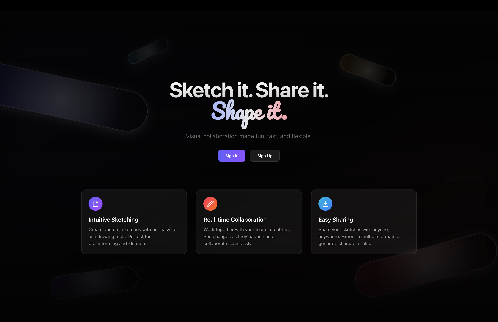

# Drawloop 🎨



[](https://deepwiki.com/whosensei/Drawloop)

A real-time collaborative drawing application built with Next.js, WebSocket, and modern web technologies. Create, share, and collaborate on drawings with multiple users in real-time with end-to-end encryption.

## ✨ Features

### 🎯 Drawing Tools
- **Shapes**: Rectangle, Triangle, Circle, Arrow, Line
- **Freehand**: Pen tool for free drawing
- **Eraser**: Smart eraser with shape detection
- **Text**: Add text annotations to your drawings

### 🎨 Customization
- **Colors**: Preset color palette + custom color picker
- **Stroke & Fill**: Independent stroke and fill color selection
- **Thickness**: Adjustable stroke width (1-8px)
- **Background**: Multiple background color options
- **Themes**: Light and dark mode support

### 🤝 Collaboration
- **Real-time sync**: See changes as they happen
- **Room-based**: Join specific drawing rooms with unique IDs
- **Multi-user**: Multiple users can draw simultaneously
- **End-to-end encryption**: Secure collaborative sessions
- **Live cursor tracking**: See where others are drawing

### 🔒 Security & Control
- **Canvas locking**: Prevent accidental modifications
- **Secure sharing**: End-to-end encrypted room sharing
- **Export functionality**: Save drawings as PNG images
- **Persistent storage**: Drawings are saved and restored

## 🚀 Quick Start

### Prerequisites
- Node.js 18+ 
- pnpm 9.0.0+

### Installation

1. **Clone the repository**
   ```bash
   git clone https://github.com/your-username/Drawloop.git
   cd Drawloop
   ```

2. **Install dependencies**
   ```bash
   pnpm install
   ```

3. **Start development servers**
   ```bash
   pnpm dev
   ```

   This will start:
   - Frontend (Next.js): `http://localhost:3000`
   - WebSocket Backend: `ws://localhost:8080`

4. **Open your browser**
   Navigate to `http://localhost:3000` and start drawing!

## 🏗️ Project Structure

This is a monorepo built with [Turborepo](https://turbo.build/repo) containing:

### Apps
- **`apps/frontend`**: Next.js application with React 19, TypeScript, and Tailwind CSS
- **`apps/ws-backend`**: WebSocket server for real-time communication

### Packages
- **`@repo/ui`**: Shared React component library
- **`@repo/db`**: Database schema and utilities with Drizzle ORM
- **`@repo/backend-common`**: Shared backend utilities
- **`@repo/common`**: Shared utilities across all services
- **`@repo/eslint-config`**: ESLint configurations
- **`@repo/typescript-config`**: TypeScript configurations

## 🛠️ Technology Stack

### Frontend
- **Framework**: Next.js 15.2.4 with React 19
- **Styling**: Tailwind CSS v4 + shadcn/ui components
- **State Management**: React hooks + WebSocket integration
- **Icons**: Lucide React
- **Animations**: Framer Motion
- **Theme**: Light/Dark mode support

### Backend
- **WebSocket**: Native WebSocket server with real-time messaging
- **Database**: Drizzle ORM
- **Authentication**: JWT tokens
- **Environment**: Node.js with TypeScript

### Development Tools
- **Monorepo**: Turborepo for build orchestration
- **Package Manager**: pnpm with workspaces
- **Code Quality**: ESLint + Prettier
- **Type Safety**: TypeScript throughout

## 📜 Available Scripts

### Development
```bash
# Start all services in development mode
pnpm dev

# Start individual services
pnpm dev --filter=frontend
pnpm dev --filter=ws-backend
```

### Production
```bash
# Build all applications
pnpm build

# Build individual applications
pnpm build:frontend
pnpm build:ws-backend

# Start production servers
pnpm start
```

### Code Quality
```bash
# Lint all code
pnpm lint

# Format code with Prettier
pnpm format

# Type checking
pnpm check-types
```

## 🎮 How to Use

1. **Create or Join a Room**: Enter a room ID or create a new one
2. **Select Tools**: Choose from rectangle, circle, pen, eraser, and more
3. **Customize**: Pick colors, adjust thickness, change background
4. **Collaborate**: Share the room link with others for real-time collaboration
5. **Save**: Export your creation as a PNG image

### Keyboard Shortcuts
- **Lock Canvas**: Prevent accidental edits
- **Clear All**: Remove all drawings from the canvas
- **Theme Toggle**: Switch between light and dark modes

## 🤝 Contributing

We welcome contributions! Please see our contributing guidelines for more details.

1. Fork the repository
2. Create a feature branch: `git checkout -b feature/amazing-feature`
3. Commit your changes: `git commit -m 'Add amazing feature'`
4. Push to the branch: `git push origin feature/amazing-feature`
5. Open a Pull Request

## 📝 License

This project is licensed under the MIT License - see the LICENSE file for details.

## 🙏 Acknowledgments

- Built with [Next.js](https://nextjs.org/)
- UI components from [shadcn/ui](https://ui.shadcn.com/)
- Icons by [Lucide](https://lucide.dev/)
- Monorepo setup with [Turborepo](https://turbo.build/repo)

---

**Happy Drawing! 🎨✨**
